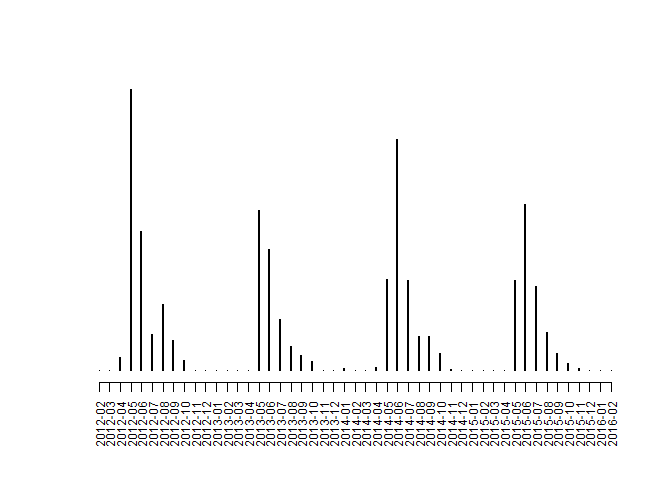
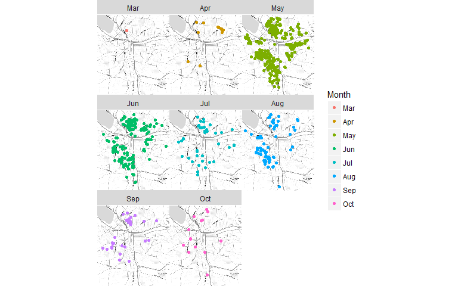

Data Driven Management II - Lab 1
================
Kyle Crichton
January 31, 2017

Setup
=====

Reads in csv file with source data and drops unnecessary columns.

``` r
data.url <- "https://raw.githubusercontent.com/lecy/code-orange/master/data/code%20violations.csv"
lab.dat <- read.csv(data.url, stringsAsFactors=F)
lab.dat <- lab.dat[ , c("Complaint.Type", "Violation.Date", "lat", "lon")]
```

Convert to Date
===============

Converts the Violation.Date column in the dataset to a date datatype.

Format is "MM/DD/YYYY".

``` r
lab.dat$Violation.Date <- as.Date(lab.dat$Violation.Date, format="%m/%d/%Y")
head(lab.dat$Violation.Date, 3)
```

    ## [1] "2011-12-22" "2011-12-22" "2011-12-22"

Creates additional variables based on the date
----------------------------------------------

Creates a new variable for the day of the week ("Mon", "Tue", "Wed", etc).

``` r
day.week <- lubridate::wday(lab.dat$Violation.Date, label=TRUE)
head(day.week, 5)
```

    ## [1] Thurs Thurs Thurs Thurs Thurs
    ## Levels: Sun < Mon < Tues < Wed < Thurs < Fri < Sat

Create variable for weeks of the year (1-52).

``` r
week.year <- lubridate::week(lab.dat$Violation.Date)
head(week.year, 5)
```

    ## [1] 51 51 51  5  5

Create variable for the month and apply ordered levels (i.e. "Jan", "Feb", "Mar", etc).

``` r
as.months <- format(lab.dat$Violation.Date, format="%b")
in.order <- c("Jan","Feb","Mar","Apr","May","Jun","Jul","Aug","Sep","Oct","Nov","Dec")
as.months <- factor(as.months, ordered=TRUE, levels=in.order)
head(as.months, 5)
```

    ## [1] Dec Dec Dec Feb Feb
    ## 12 Levels: Jan < Feb < Mar < Apr < May < Jun < Jul < Aug < Sep < ... < Dec

Create variable for the year (2012, 2013, 2014...).

``` r
as.years <- format(lab.dat$Violation.Date, format="%Y")
head(as.years, 5)
```

    ## [1] "2011" "2011" "2011" "2012" "2012"

Stores the new variables in the data frame.

``` r
lab.dat$Day.Week <- day.week
lab.dat$Week.Year <- week.year
lab.dat$Month <- as.months
lab.dat$Year <- as.years
```

Overgrowth Violations
=====================

Creates a subset of the original dataset for violations related to overgrowth.

The violation code is "Overgrowth: Private, Occ".

``` r
overgrowth <- lab.dat[lab.dat$Complaint.Type == "Overgrowth: Private, Occ", ]
```

Number of Overgrowth Violations Each Year
-----------------------------------------

Displays the number of violations aggregated by year.

``` r
table(overgrowth$Year)
```

    ## 
    ## 2012 2013 2014 2015 2016 
    ##  928  614  809  651    1

A higher number of violations were reported in 2012 and 2014.

Violations by Month Since February 2012
---------------------------------------

Graphs the number of violations each month.

A new column is added to the table to represent the year-month combination.

Levels had to be manually adjusted to compensate for order and missing month-year values.

``` r
overgrowth$Year.Month <- format(overgrowth$Violation.Date, "%Y-%m")
YM.levels <- c("2012-02","2012-03","2012-04","2012-05","2012-06","2012-07","2012-08","2012-09","2012-10","2012-11","2012-12","2013-01","2013-02","2013-03","2013-04","2013-05","2013-06","2013-07","2013-08","2013-09","2013-10","2013-11","2013-12","2014-01","2014-02","2014-03","2014-04","2014-05","2014-06","2014-07","2014-08","2014-09","2014-10","2014-11","2014-12","2015-01","2015-02","2015-03","2015-04","2015-05","2015-06","2015-07","2015-08","2015-09","2015-10","2015-11","2015-12","2016-01","2016-02")
overgrowth$Year.Month <- factor(overgrowth$Year.Month, ordered="TRUE", levels=YM.levels)
plot( table( overgrowth$Year.Month ), ylab="", las=2, cex.axis = 0.75, yaxt="n")
```



Not suprisingly, violations peak in the summer months. Especially in April and June.

Overgrowth Violations in 2012
=============================

Diving a bit deeper into the violations that occurred during the peak year of 2012.

First we select a subset of the overgrowth data where the year is 2012. Then we further refine the datset limiting geographic locations within Syracuse.

``` r
overgrowth12 <- overgrowth[overgrowth$Year==2012,]
overgrowth12 <- overgrowth12[overgrowth12$lat > 42.96 & overgrowth12$lat < 43.12 & overgrowth12$lon > -76.25 & overgrowth12$lon < -76.05, ]
```

Map overgrowth violations by month:

``` r
qmplot(lon, lat, data = overgrowth12, maptype = "toner-lite", color = Month) + facet_wrap(~ Month) 
```


