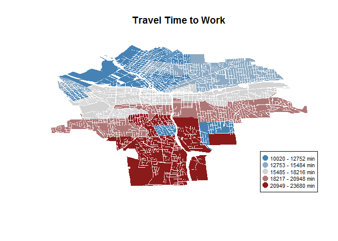
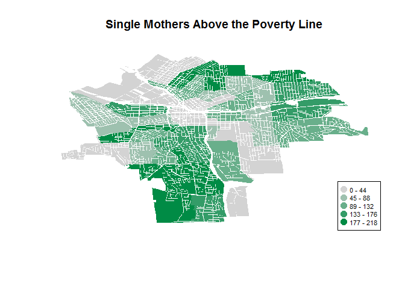
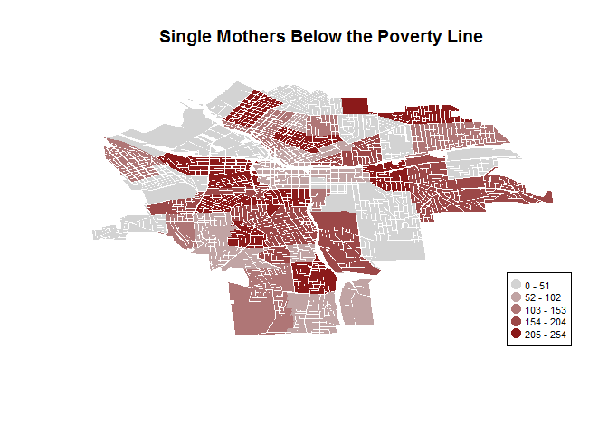

Data Driven Management II - Lab 3
================
Kyle Crichton
February 14, 2017

Setup
=====

Include relevant libararies for retrieving data from the census api and mapping shapefiles.

``` r
library(sp)
library(maptools)
library(censusapi)
```

Census Data
===========

Retrieve Census Data
--------------------

Store censusapi key to be used in the api call.

``` r
cKey <- "c4a7ded6e9442cdb7584465e73b4aff65aeaff8e"
```

Get Census Data and filter to applicable tracts.

``` r
syrData <- getCensus(name="acs5", vintage=2015, key=cKey, 
                  vars=c("B08136_001E", "B17010_017E", "B17010_037E"), 
                  region="tract:*", regionin="state:36+county:067")
```

Rename data frame columns to be logical

B08136\_001E is Travel Time to Work B17010\_017E is Single Mothers Below Poverty Level B17010\_037E is Single Mothers Above Poverty Level

``` r
col.name <- c("State", "County", "Tract", "Transport", "SM_Below", "SM_Above")
colnames(syrData) <- col.name
```

Format census data
------------------

Convert census tract to decimal format with two decimal places in order to match census data to shapefiles.

Census tract returned in the api is a five character long string ("00501") but the data in the shapefile is a decimal with two decimal places (5.01).

``` r
options(digits = 2)
syrData$Tract <- as.numeric(syrData$Tract)/100
```

Limit tracts in dataset to those in shapefiles.

This is important in order to get a proper range for colors.

``` r
syrData <- syrData[which(syrData$Tract < 61.04), ]
```

Shapefiles
==========

Read in the TIGER shapefiles for Syracuse.

``` r
syr <- readShapePoly(fn="C:/Users/krcrichton/Documents/R/Support_Files/01-05-2015/01-05-2015",proj4string=CRS("+proj=longlat +datum=WGS84"))
```

Match shapefiles to the census data by census tract

``` r
tract.order <- match(syr$CensusTrac, syrData$Tract)
```

Aggregate Transit Time to Work
==============================

This data is aggreagated in the census tract and stored in minutes.

What would be more interesting, given some more time, would be to use the average transit time using census api fields population, employment rate and work from home rate. For now, this will track transit time in the aggregate.

Format color scale and slices

``` r
color.range <- colorRampPalette( c("steel blue","light gray","firebrick4" ) )
color.ramp <- color.range( 5 )
```

Break tranport time data into levels.

``` r
transport.vector <- cut(rank(syrData$Transport), breaks=5, labels=color.ramp)
transport.vector <- as.character(transport.vector)
```

Apply color and plot transit time.

``` r
color.order <- transport.vector[tract.order]
plot(syr, border=FALSE, col=color.order, main="Travel Time to Work")

legend.ranges <- c("10020 - 12752 min","12753 - 15484 min","15485 - 18216 min","18217 - 20948 min","20949 - 23680 min")

legend("bottomright", bg="white", pch=19, pt.cex=1.5, cex=0.7, legend=legend.ranges, col=color.ramp)
```



Single Mothers Above the Poverty Line
=====================================

Format color scale and slices

``` r
color.range <- colorRampPalette( c("light gray","springgreen4" ) )
color.ramp <- color.range( 5 )
```

Break data into levels.

``` r
SM_Above.vector <- cut(rank(syrData$SM_Above), breaks=5, labels=color.ramp)
SM_Above.vector <- as.character(SM_Above.vector)
```

Apply color and plot transit time.

``` r
color.order <- SM_Above.vector[tract.order]
plot(syr, border=FALSE, col=color.order, main="Single Mothers Above the Poverty Line")

legend.ranges <- c("0 - 44","45 - 88","89 - 132","133 - 176","177 - 218")
legend("bottomright", bg="white", pch=19, pt.cex=1.5, cex=0.7, legend=legend.ranges, col=color.ramp)
```



Single Mothers Below the Poverty Line
=====================================

Format color scale and slices

``` r
color.range <- colorRampPalette( c("light gray","firebrick4" ))
color.ramp <- color.range( 5 )
```

Break data into levels.

``` r
SM_Below.vector <- cut(rank(syrData$SM_Below), breaks=5, labels=color.ramp)
SM_Below.vector <- as.character(SM_Below.vector)
```

Apply color and plot transit time.

``` r
color.order <- SM_Below.vector[tract.order]
plot(syr, border=FALSE, col=color.order, main="Single Mothers Below the Poverty Line")

legend.ranges <- c("0 - 51","52 - 102","103 - 153","154 - 204","205 - 254")

legend("bottomright", bg="white", pch=19, pt.cex=1.5, cex=0.7, legend=legend.ranges, col=color.ramp)
```


