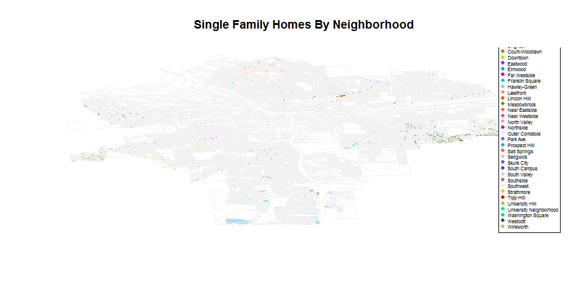
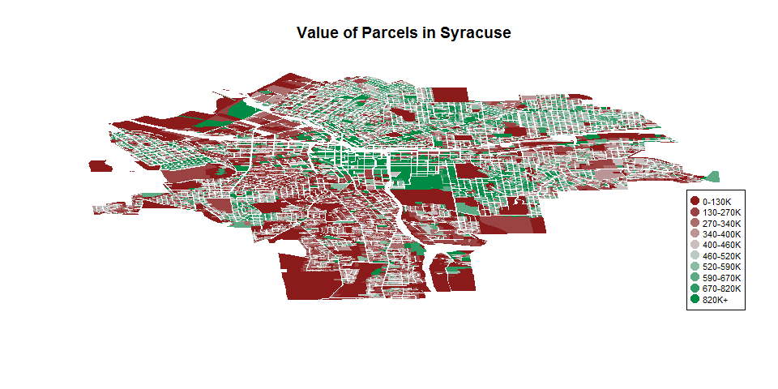
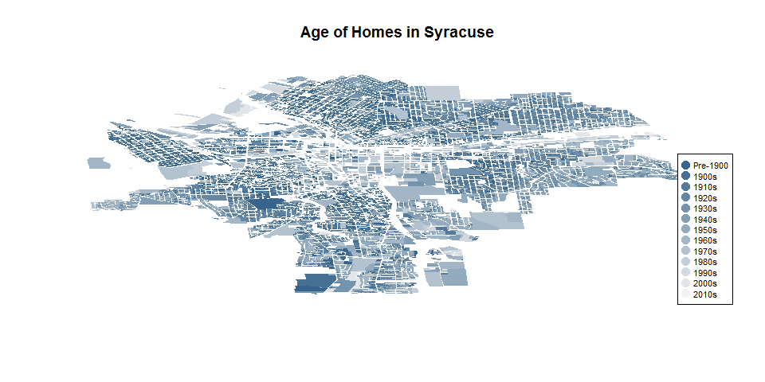

Data Driven Management II - Lab 4
================
Kyle Crichton
February 14, 2017

Setup
=====

Include relevant libararies for mapping shapefiles.

``` r
library(plyr)
library(sp)
library(maptools)
```

Read in the TIGER shapefiles for Syracuse.

``` r
syr <- readShapePoly(fn="C:/Users/krcrichton/Documents/R/Support_Files/01-05-2015/01-05-2015",proj4string=CRS("+proj=longlat +datum=WGS84"))
```

Single Family Homes Per Neighborhood
====================================

Number of Single Family Homes by Neighborhood
---------------------------------------------

Display a table of single family homes by neighborhood in Syracuse.

``` r
table(syr$Nhood[syr$LandUse == "Single Family"])
```

    ## 
    ##                Brighton          Court-Woodlawn                Downtown 
    ##                    1398                    1859                       1 
    ##                Eastwood                 Elmwood            Far Westside 
    ##                    3605                     909                     471 
    ##         Franklin Square            Hawley-Green               Lakefront 
    ##                       0                      52                      24 
    ##            Lincoln Hill             Meadowbrook           Near Eastside 
    ##                     580                    1721                      93 
    ##           Near Westside            North Valley               Northside 
    ##                     521                    1194                    1508 
    ##          Outer Comstock               Park Ave.           Prospect Hill 
    ##                     697                     167                      29 
    ##            Salt Springs                Sedgwick              Skunk City 
    ##                    1029                     892                     345 
    ##            South Campus            South Valley               Southside 
    ##                      25                    1605                     481 
    ##               Southwest              Strathmore               Tipp Hill 
    ##                     419                    1475                     785 
    ##         University Hill University Neighborhood       Washington Square 
    ##                      17                     803                     425 
    ##                Westcott               Winkworth 
    ##                     851                     411

Single Family Homes Across Syracuse
-----------------------------------

Setup plot by mapping colors to different neighbohoods.

``` r
color.Nhood <- c("cornflowerblue","chocolate","chartreuse","blueviolet","dodgerblue","deeppink3","darkturquoise","darkseagreen3","darksalmon","darkorange3","darkolivegreen4","indianred2","mediumorchid","navajowhite3","mediumvioletred","mistyrose1","royalblue1","steelblue3","tomato","snow3","slateblue3","mediumpurple4","lightblue2","mistyrose4","thistle1","gold2","firebrick","olivedrab3","springgreen2","cyan3","grey27", "darkkhaki")
palette(color.Nhood)

Nhood.Color <- factor(syr$Nhood)
Nhood.Color[syr$LandUse != "Single Family"] <- NA
```

Map single family homes in each neighborhood. Colors signify different neighborhoods.

``` r
plot(syr, border="grey95", col=Nhood.Color, main="Single Family Homes By Neighborhood")

legend("bottomright", bg="white", pch=19, pt.cex=0.8, cex=0.5, legend=levels(syr$Nhood), col=color.Nhood)
```



Land Value of Homes Across Syracuse
===================================

Percent of Homes valued over $200K by Neighborhood
--------------------------------------------------

Display a table of single family homes valued over $200k as a percentage of all single family homes by neighborhood.

``` r
syr$IS_SF <- ifelse(syr$LandUse == 'Single Family', 1, 0)
syr$IS_SF200K <- ifelse(syr$LandUse == "Single Family" & syr$AssessedVa > 200000, 1, 0)

Nhood.SF <- aggregate(syr$IS_SF, by = list(syr$Nhood), FUN = sum)
Nhood.SF200K <- aggregate(syr$IS_SF200K, by = list(syr$Nhood), FUN = sum)
Nhood.SF200K$x <- as.character(round((Nhood.SF200K$x/Nhood.SF$x) * 100, digits = 4))
Nhood.SF200K$x <- paste(ifelse(Nhood.SF200K$x == "NaN","0", Nhood.SF200K$x), "%", "")
names(Nhood.SF200K) <- c("Neighborhood", "Percent 200K+ Homes")
Nhood.SF200K
```

    ##               Neighborhood Percent 200K+ Homes
    ## 1                 Brighton                0 % 
    ## 2           Court-Woodlawn                0 % 
    ## 3                 Downtown                0 % 
    ## 4                 Eastwood           0.0277 % 
    ## 5                  Elmwood                0 % 
    ## 6             Far Westside                0 % 
    ## 7          Franklin Square                0 % 
    ## 8             Hawley-Green                0 % 
    ## 9                Lakefront                0 % 
    ## 10            Lincoln Hill           1.2069 % 
    ## 11             Meadowbrook           3.4863 % 
    ## 12           Near Eastside                0 % 
    ## 13           Near Westside                0 % 
    ## 14            North Valley                0 % 
    ## 15               Northside           0.1326 % 
    ## 16          Outer Comstock           0.4304 % 
    ## 17               Park Ave.                0 % 
    ## 18           Prospect Hill                0 % 
    ## 19            Salt Springs                0 % 
    ## 20                Sedgwick           14.574 % 
    ## 21              Skunk City                0 % 
    ## 22            South Campus                0 % 
    ## 23            South Valley           0.3115 % 
    ## 24               Southside                0 % 
    ## 25               Southwest                0 % 
    ## 26              Strathmore           1.0847 % 
    ## 27               Tipp Hill                0 % 
    ## 28         University Hill           5.8824 % 
    ## 29 University Neighborhood           2.1171 % 
    ## 30       Washington Square                0 % 
    ## 31                Westcott                0 % 
    ## 32               Winkworth           2.6764 %

Parcel Value Per Acre Across Syracuse
-------------------------------------

Create a new field for value per acre and assign colors to display.

``` r
syr$value.acre <- syr$AssessedVa/syr$Acres

color.range <- colorRampPalette( c("firebrick4","light gray","springgreen4" ) )
color.ramp <- color.range( 10 )

value.acre <- cut(rank(syr$value.acre), breaks=10, labels=color.ramp)
value.acre <- as.character(value.acre)
```

Plot the value per acre of parcels in the city of Syracuse.

``` r
plot(syr, border=FALSE, col=value.acre, main="Value of Parcels in Syracuse")

legend.ranges <- c("0-130K","130-270K","270-340K","340-400K","400-460K","460-520K","520-590K","590-670K","670-820K", "820K+")
legend("bottomright", bg="white", pch=19, pt.cex=1.5, cex=0.7, legend=legend.ranges, col=color.ramp)
```



Age of Homes Across Syracuse
============================

Age Percentile by Neighborhood
------------------------------

Store percentiles as a vector

``` r
Ptiles <- c(0.1, 0.25, 0.5, 0.75, 0.9)
```

Store logical condition for residential houses.

``` r
residential <- syr$LandUse == "Single Family" | syr$LandUse == "Two Family" | syr$LandUse == "Three Family" | syr$LandUse == "Multiple Residence" | syr$LandUse == "Apartment"
```

Store residential year built data and convert to integer age of home. Also it is quite illogical to have to convert factors to characters before converting to integers. This tripped me up for a good two hours. Come on R, two conversions... really?

``` r
syr$Home.Age <- 2017 - as.integer(as.character(syr$YearBuilt))
Home.Age <- as.data.frame(syr[residential, c("Nhood", "Home.Age")])

by(Home.Age$Home.Age, Home.Age$Nhood, function(x) quantile(Home.Age$Home.Age, Ptiles, na.rm = TRUE))
```

    ## Home.Age$Nhood: Brighton
    ## 10% 25% 50% 75% 90% 
    ##  59  74  92 107 117 
    ## -------------------------------------------------------- 
    ## Home.Age$Nhood: Court-Woodlawn
    ## 10% 25% 50% 75% 90% 
    ##  59  74  92 107 117 
    ## -------------------------------------------------------- 
    ## Home.Age$Nhood: Downtown
    ## 10% 25% 50% 75% 90% 
    ##  59  74  92 107 117 
    ## -------------------------------------------------------- 
    ## Home.Age$Nhood: Eastwood
    ## 10% 25% 50% 75% 90% 
    ##  59  74  92 107 117 
    ## -------------------------------------------------------- 
    ## Home.Age$Nhood: Elmwood
    ## 10% 25% 50% 75% 90% 
    ##  59  74  92 107 117 
    ## -------------------------------------------------------- 
    ## Home.Age$Nhood: Far Westside
    ## 10% 25% 50% 75% 90% 
    ##  59  74  92 107 117 
    ## -------------------------------------------------------- 
    ## Home.Age$Nhood: Franklin Square
    ## 10% 25% 50% 75% 90% 
    ##  59  74  92 107 117 
    ## -------------------------------------------------------- 
    ## Home.Age$Nhood: Hawley-Green
    ## 10% 25% 50% 75% 90% 
    ##  59  74  92 107 117 
    ## -------------------------------------------------------- 
    ## Home.Age$Nhood: Lakefront
    ## 10% 25% 50% 75% 90% 
    ##  59  74  92 107 117 
    ## -------------------------------------------------------- 
    ## Home.Age$Nhood: Lincoln Hill
    ## 10% 25% 50% 75% 90% 
    ##  59  74  92 107 117 
    ## -------------------------------------------------------- 
    ## Home.Age$Nhood: Meadowbrook
    ## 10% 25% 50% 75% 90% 
    ##  59  74  92 107 117 
    ## -------------------------------------------------------- 
    ## Home.Age$Nhood: Near Eastside
    ## 10% 25% 50% 75% 90% 
    ##  59  74  92 107 117 
    ## -------------------------------------------------------- 
    ## Home.Age$Nhood: Near Westside
    ## 10% 25% 50% 75% 90% 
    ##  59  74  92 107 117 
    ## -------------------------------------------------------- 
    ## Home.Age$Nhood: North Valley
    ## 10% 25% 50% 75% 90% 
    ##  59  74  92 107 117 
    ## -------------------------------------------------------- 
    ## Home.Age$Nhood: Northside
    ## 10% 25% 50% 75% 90% 
    ##  59  74  92 107 117 
    ## -------------------------------------------------------- 
    ## Home.Age$Nhood: Outer Comstock
    ## 10% 25% 50% 75% 90% 
    ##  59  74  92 107 117 
    ## -------------------------------------------------------- 
    ## Home.Age$Nhood: Park Ave.
    ## 10% 25% 50% 75% 90% 
    ##  59  74  92 107 117 
    ## -------------------------------------------------------- 
    ## Home.Age$Nhood: Prospect Hill
    ## 10% 25% 50% 75% 90% 
    ##  59  74  92 107 117 
    ## -------------------------------------------------------- 
    ## Home.Age$Nhood: Salt Springs
    ## 10% 25% 50% 75% 90% 
    ##  59  74  92 107 117 
    ## -------------------------------------------------------- 
    ## Home.Age$Nhood: Sedgwick
    ## 10% 25% 50% 75% 90% 
    ##  59  74  92 107 117 
    ## -------------------------------------------------------- 
    ## Home.Age$Nhood: Skunk City
    ## 10% 25% 50% 75% 90% 
    ##  59  74  92 107 117 
    ## -------------------------------------------------------- 
    ## Home.Age$Nhood: South Campus
    ## 10% 25% 50% 75% 90% 
    ##  59  74  92 107 117 
    ## -------------------------------------------------------- 
    ## Home.Age$Nhood: South Valley
    ## 10% 25% 50% 75% 90% 
    ##  59  74  92 107 117 
    ## -------------------------------------------------------- 
    ## Home.Age$Nhood: Southside
    ## 10% 25% 50% 75% 90% 
    ##  59  74  92 107 117 
    ## -------------------------------------------------------- 
    ## Home.Age$Nhood: Southwest
    ## 10% 25% 50% 75% 90% 
    ##  59  74  92 107 117 
    ## -------------------------------------------------------- 
    ## Home.Age$Nhood: Strathmore
    ## 10% 25% 50% 75% 90% 
    ##  59  74  92 107 117 
    ## -------------------------------------------------------- 
    ## Home.Age$Nhood: Tipp Hill
    ## 10% 25% 50% 75% 90% 
    ##  59  74  92 107 117 
    ## -------------------------------------------------------- 
    ## Home.Age$Nhood: University Hill
    ## 10% 25% 50% 75% 90% 
    ##  59  74  92 107 117 
    ## -------------------------------------------------------- 
    ## Home.Age$Nhood: University Neighborhood
    ## 10% 25% 50% 75% 90% 
    ##  59  74  92 107 117 
    ## -------------------------------------------------------- 
    ## Home.Age$Nhood: Washington Square
    ## 10% 25% 50% 75% 90% 
    ##  59  74  92 107 117 
    ## -------------------------------------------------------- 
    ## Home.Age$Nhood: Westcott
    ## 10% 25% 50% 75% 90% 
    ##  59  74  92 107 117 
    ## -------------------------------------------------------- 
    ## Home.Age$Nhood: Winkworth
    ## 10% 25% 50% 75% 90% 
    ##  59  74  92 107 117

Age of Homes Across Syracuse
----------------------------

Applies colors to decade of building constuction

``` r
color.range <- colorRampPalette( c("steelblue4","grey95") )
color.ramp <- color.range(13)
age.home <- cut(as.integer(as.character(syr$YearBuilt)), breaks=c(1790,1900,1910,1920,1930,1940,1950,1960,1970,1980,1990,2000,2010,2020), labels=color.ramp)
age.home <- as.character(age.home)
```

Plot the age of home in the city of Syracuse.

``` r
plot(syr, border=FALSE, col=age.home, main="Age of Homes in Syracuse")

legend.ranges <- c("Pre-1900","1900s","1910s","1920s","1930s","1940s","1950s","1960s","1970s","1980s","1990s","2000s","2010s")
legend("bottomright", bg="white", pch=19, pt.cex=1.5, cex=0.7, legend=legend.ranges, col=color.ramp)
```


