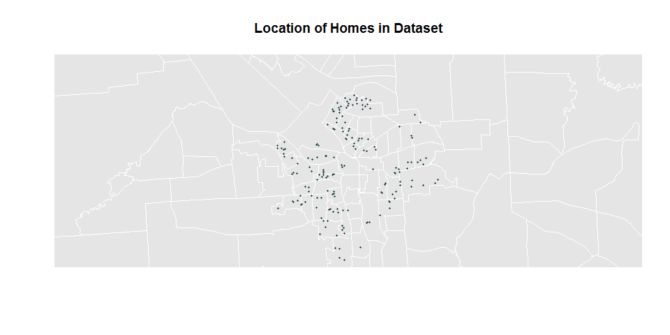

Data Drive Management II - Lab 5
================
Kyle Crichton
February 17, 2017

Setup
=====

Load Packages

``` r
library(RCurl)
library(sp)
library(maptools)
library(censusapi)
library(ggmap)
```

Housing Data
============

Load Home Price Dataset
-----------------------

Store URL for data, read in as a csv and store data as data frrame.

``` r
my.url <- "https://docs.google.com/spreadsheets/d/1W0vM5sCRhZjkQh6A0WGV8j1rhQAjecCrQW7PguHft-E/pub?gid=1989082857&single=true&output=csv"

dat.raw <- getURL( my.url, ssl.verifypeer=FALSE )

dat <- read.csv( textConnection(dat.raw), stringsAsFactors=FALSE )
```

Rename data frame columns

``` r
names(dat) <- c("timestamp","price","X1","X2","sqft","your.name","lot.size","beds","bath","garage","year","elementary","middle","high","walk","tax","highway","restaurant","starbucks","park","mall","address","zip","tract" )
```

Sample of the dataset is below:

    ##            timestamp      price X1 X2     sqft      your.name  lot.size
    ## 1 1/15/2015 16:11:46 179,900.00 NA NA 1,600.00 Emily Simonson 43,560.00
    ## 2 1/15/2015 16:17:10 128,000.00 NA NA 1,992.00 Emily Simonson  6,969.00
    ## 3 1/15/2015 16:25:52 114,900.00 NA NA 1,378.00 Emily Simonson  5,227.00
    ## 4 1/15/2015 16:34:22 107,500.00 NA NA 1,452.00 Emily Simonson  5,227.00
    ## 5 1/15/2015 16:41:35  43,000.00 NA NA   850.00 Emily Simonson  6,098.00
    ## 6 1/15/2015 16:52:22  85,000.00 NA NA 1,639.00 Emily Simonson  7,840.00
    ##   beds bath garage year elementary middle high walk      tax highway
    ## 1    3  2.0    Yes 1994          9      4    2   15 3,182.00      No
    ## 2    4  2.5    Yes 1950          2      4    2   43 1,393.00      No
    ## 3    4  1.0    Yes 1930          2      4    2   50 1,331.00      No
    ## 4    3  1.0    Yes 1931          2      4    1   42   157.00      No
    ## 5    2  1.0    Yes 1955          2      9    1   57 1,525.00      No
    ## 6    4  1.0     No 1915          2      4    1   36 2,184.00      No
    ##   restaurant starbucks park mall            address   zip tract
    ## 1         22       3.2   18  1.3 504 Winkworth Pkwy 13219    NA
    ## 2          7       2.6    5  0.6     136 Austin Ave 13207    NA
    ## 3          6       2.6    7  0.5     701 Velasko Rd 13207    NA
    ## 4         12       2.6    8  0.8    518 Wolcott Ave 13207    NA
    ## 5          8       2.3   20  0.6    112 Wolcott Ave 13207    NA
    ## 6         32       1.9   11  2.5    212 Roberts Ave 13207    NA

Format Dataset for Analysis
---------------------------

Remove commas from strings and convert to numerics.

``` r
dat$price <- as.numeric( gsub( ",","", dat$price ) )
dat$tax <- as.numeric( gsub( ",","", dat$tax ) )
dat$lot.size <- as.numeric( gsub( ",","", dat$lot.size ) )
dat$sqft <- as.numeric( gsub( ",","", dat$sqft ) )
dat$lot.size[ is.na( dat$lot.size ) ] <- mean( dat$lot.size, na.rm=T )
```

Geocode House Data
==================

Data Cleansing on Addresses
---------------------------

Some of the addresses stored in the address field are just street addresses, but some contain the city, state and zipcode in addition to the street address. We want complete street addresses when geocoding the data but in order to standardize the formats we will first remove the extra information from the fields before adding the city, state and zipcode back in.

Example of the unstandardized data:

    ## [1] "202 Hutchinson Ave Syracuse, NY"         
    ## [2] "209 2nd North St."                       
    ## [3] "133 Walton St APT 138, Syracuse, NY"     
    ## [4] "108 W Jefferson St APT 808, Syracuse, NY"
    ## [5] "209 2nd North St, Syracuse, NY 13208"

Remove the strings ", Syracuse NY", ", Syracuse, NY", "Syracuse NY" and "Syracuse, NY"

``` r
dat$address <- sub(", Syracuse NY", "", dat$address)
dat$address <- sub(", Syracuse, NY", "", dat$address)
dat$address <- sub("Syracuse NY", "", dat$address)
dat$address <- sub("Syracuse, NY", "", dat$address)
```

Remove regular expression patterns matching 5 digits at the end of a string (zipcodes).

``` r
dat$address <- sub("[0-9]{5}$", "", dat$address)
```

Trim leftover trailing whitespace

``` r
dat$address <- sub("\\s+$", "", dat$address)
```

Fix bad zipcode (change 1323 to 13203)

``` r
dat$zip <- sub("1323", "13203", dat$zip)
```

Fixed Data:

    ## [1] "202 Hutchinson Ave"         "209 2nd North St."         
    ## [3] "133 Walton St APT 138"      "108 W Jefferson St APT 808"
    ## [5] "209 2nd North St"

Concatenate Address Fields
--------------------------

Pulls together the standardized address field, appends the city (Syracuse) and state (NY), and then concats the zipcode field.

``` r
dat$full.addr <- paste(dat$address, ",", sep="")
dat$full.addr <- paste(dat$full.addr, "Syracuse, NY", dat$zip, sep=" ")
```

Sample of full address data:

    ## [1] "202 Hutchinson Ave, Syracuse, NY 13207"        
    ## [2] "209 2nd North St., Syracuse, NY 13208"         
    ## [3] "133 Walton St APT 138, Syracuse, NY 13202"     
    ## [4] "108 W Jefferson St APT 808, Syracuse, NY 13202"
    ## [5] "209 2nd North St, Syracuse, NY 13206"

Geocode Addresses
-----------------

``` r
options( warn=-1 ) 

suppressMessages( dat$coords <- geocode(dat$full.addr, messaging=F ))
```

Shapefiles
==========

Read in the census tract shapefiles for Syracuse.

``` r
syr <- readShapePoly(fn="C:/Users/krcrichton/Documents/R/Support_Files/tl_2015_36_tract/tl_2015_36_tract",proj4string=CRS("+proj=longlat +datum=WGS84"))
```

Spatial Join - Census Tract
===========================

Convert spatial coordinates to match shapefiles projection and match house points to census tract polygons.

``` r
houses <- SpatialPoints(dat$coords, proj4string=CRS("+proj=longlat +datum=WGS84"))
tracts.houses <- over(houses, syr)
dat.fips <- tracts.houses[,"GEOID"]
```

Map house locations

``` r
plot(syr, border="white", col="grey90", main="Location of Homes in Dataset", xlim=c(-76.2, -76.1), ylim=c(43.0, 43.1))
points(dat$coords, pch=20, cex = 0.7, col="darkslategrey")
```



Store FIPS ID in house dataset.

``` r
dat$fips <- tracts.houses$GEOID
```

Sample of FIPS IDs:

    ## [1] 36067004800 36067004800 36067004800 36067004800 36067004800 36067005000
    ## 4918 Levels: 36001000100 36001000200 36001000300 36001000401 ... 36123150500

Census Data
===========

Retrieve Census Data
--------------------

Store censusapi key to be used in the api call.

``` r
cKey <- "c4a7ded6e9442cdb7584465e73b4aff65aeaff8e"
```

Get census data and limit to Syracuse area.

``` r
census.dat <- getCensus(name="acs5", vintage=2015, key=cKey, 
                  vars=c("B08136_001E", "B23025_005E", "B19301_001E"), 
                  region="tract:*", regionin="state:36+county:067")
```

Rename data frame columns to be logical

B08136\_001E is Travel Time to Work B23025\_005E is Unemployed B19301\_001E is Per Capita Income

``` r
col.name <- c("State", "County", "Tract", "Transit", "Unemployed", "Income")
colnames(census.dat) <- col.name
```

Format census data
------------------

Convert census tract to match format in the houses dataset.

Census tract returned in the api is a six character string ("000501").

    ## [1] "000100" "000200" "000300" "000400" "000501" "000600"

But the fips codes matched in the spatial join is an eleven character string ("36067000501").

    ## [1] 36067004800 36067004800 36067004800 36067004800 36067004800 36067005000
    ## 4918 Levels: 36001000100 36001000200 36001000300 36001000401 ... 36123150500

Append "36067" to the census data tract fields

``` r
census.dat$Tract <- paste("36067", census.dat$Tract, sep="")
```

New census tract codes:

    ## [1] "36067000100" "36067000200" "36067000300" "36067000400" "36067000501"
    ## [6] "36067000600"

Join datsets
------------

Match census data to homes dataset using FIPS codes and store matching census data to houses.

``` r
tract.order <- match(dat$fips, census.dat$Tract)
dat$transit <- census.dat$Transit[tract.order]
dat$unemployed <- census.dat$Unemployed[tract.order]
dat$income <- census.dat$Income[tract.order]
```

Aggregate Crime
===============

Load crime data from csv file.

``` r
crime.dat <- read.csv( "Data/Crime_Locations.csv" )
head(crime.dat)
```

    ##         lon      lat
    ## 1 -76.16636 43.05239
    ## 2 -76.11191 43.02917
    ## 3 -76.11991 43.04385
    ## 4 -76.12334 43.06962
    ## 5 -76.12238 43.15594
    ## 6 -76.14150 43.09776

Convert to spatial points and perform spatial join to census tract shapefiles.

``` r
crime.coord <- crime.dat[ ,c("lon","lat")]
crime <- SpatialPoints(crime.coord, proj4string=CRS("+proj=longlat +datum=WGS84"))
tracts.crime <- over(crime, syr)  
```

Aggregate crimes by census tract.

``` r
tracts.crime$count <- rep.int(1, 757)
crime.agg <- aggregate(tracts.crime$count, list(tracts.crime$GEOID), FUN="sum")
names(crime.agg) <- c("FIPS", "Crimes")
head(crime.agg)
```

    ##          FIPS Crimes
    ## 1 36053030401      1
    ## 2 36067000100     45
    ## 3 36067000200     11
    ## 4 36067000300      2
    ## 5 36067000400     10
    ## 6 36067000501     13

Join aggegrated crime data to homes datset

``` r
tract.order <- match(dat$fips, crime.agg$FIPS)
dat$crimes <- crime.agg$Crimes[tract.order]
```
