Data Driven Management II - Lab 6
================
Kyle Crichton
March 8, 2017

Setup
=====

Load Packages

``` r
library(maptools)
library(sp)
library(rgeos)
library(raster)
library(RCurl)
library(ggmap)
library(dplyr)
library(rgdal)
```

Part I
======

Download Tiger Shapefiles
-------------------------

Dowloads zip of census track shapefiles, unzips and removes zipped file.

``` r
download.file("ftp://ftp2.census.gov/geo/tiger/TIGER2010/TRACT/2010/tl_2010_36067_tract10.zip", "Support Files/onondaga census tracts.zip")

unzip("Support Files/onondaga census tracts.zip", exdir = "Support Files/CensusTracks")

file.remove("Support Files/onondaga census tracts.zip")
```

    ## [1] TRUE

Dowloads zip of primary and secondary road shapefiles, unzips and removes zipped file.

``` r
download.file("ftp://ftp2.census.gov/geo/tiger/TIGER2015/PRISECROADS/tl_2015_36_prisecroads.zip", "Support Files/primary_and_secondary_roads.zip" )

unzip("Support Files/primary_and_secondary_roads.zip", exdir = "Support Files/Roads")

file.remove("Support Files/primary_and_secondary_roads.zip")
```

    ## [1] TRUE

Load and Plot Shapefiles
------------------------

Loads shapefiles for census tracks and roads.

``` r
syr <- readShapePoly(fn="Support Files/CensusTracks/tl_2010_36067_tract10", proj4string=CRS("+proj=longlat +datum=WGS84"))

roads <- readShapeLines(fn="Support Files/Roads/tl_2015_36_prisecroads", proj4string=CRS("+proj=longlat +datum=WGS84"))
```

Plot census tracks and roads.

``` r
par(mar=c(0,0,0,0))
plot(syr, col="grey90" , border="grey40")
plot(roads, col="steelblue", lwd=1, add=T)
```

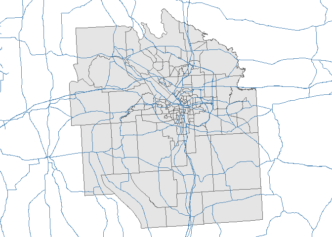

Extract Interstates
-------------------

Extracts interstates from clipped roads shapefile.

``` r
interstate <- roads[roads$RTTYP == "I", ]
```

Highlight interstates on plot.

``` r
plot(syr, col="grey90" , border="grey40")
plot(roads, col="steel blue", lwd=1, add=T)
plot(interstate, col="red", lwd=1, add=T)
```

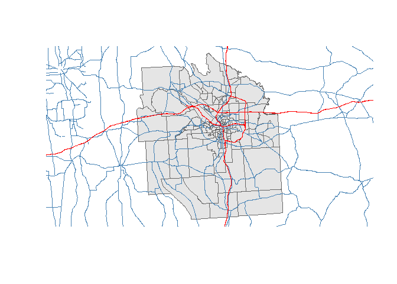

Clip Interstates
----------------

Creates a bounding polygon by mering the census track shapefiles. In other words, creates an outer border which to clip the roads.

``` r
border <- gUnaryUnion(syr)
plot(border, col="white" , border="grey40")
plot(roads, col="steelblue", lwd=1, add=T)
```

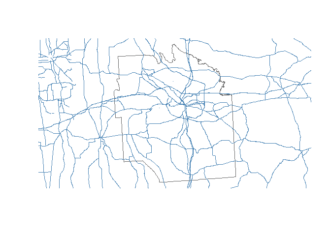

Clips road shapefiles to fit within the census track border.

``` r
roads.clipped <- gIntersection(interstate, border)
```

Plot census tracks and roads again to show clipping.

``` r
plot(syr, col="grey90" , border="grey40")
plot(roads.clipped, col="red", lwd=1, add=T)
```

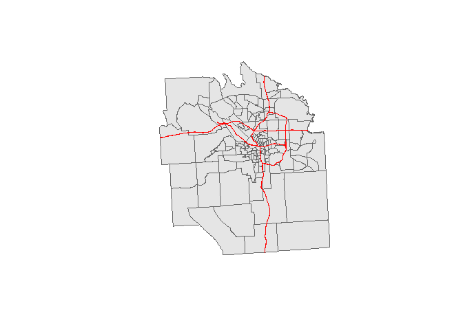

Create Buffer
-------------

Generates a buffer of approximately a quarter mile around each of the interstates.

``` r
buffer <- gBuffer(roads.clipped, width = .004)
```

Plot buffer

``` r
par(mar=c(0,0,0,0))
plot(syr, col="grey90" , border="grey40")
plot(roads.clipped, col="red", lwd=1, add=T)
plot(buffer, border="darkorange3", add=T)
```

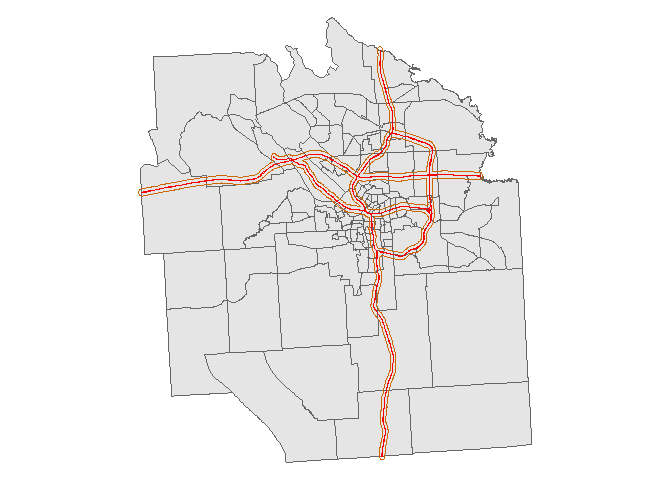

Housing Data
------------

Store URL for data, read in as a csv and store data as data frame.

``` r
my.url <- "https://docs.google.com/spreadsheets/d/1W0vM5sCRhZjkQh6A0WGV8j1rhQAjecCrQW7PguHft-E/pub?gid=1989082857&single=true&output=csv"
dat.raw <- getURL( my.url, ssl.verifypeer=FALSE )
dat <- read.csv( textConnection(dat.raw), stringsAsFactors=FALSE )
```

Rename data frame columns

``` r
names(dat) <- c("timestamp","price","X1","X2","sqft","your.name","lot.size","beds","bath","garage","year","elementary","middle","high","walk","tax","highway","restaurant","starbucks","park","mall","address","zip","tract" )
```

### Format Dataset for Analysis

Remove commas from strings and convert to numerics.

``` r
dat$price <- as.numeric( gsub( ",","", dat$price ) )
dat$tax <- as.numeric( gsub( ",","", dat$tax ) )
dat$lot.size <- as.numeric( gsub( ",","", dat$lot.size ) )
dat$sqft <- as.numeric( gsub( ",","", dat$sqft ) )
dat$lot.size[ is.na( dat$lot.size ) ] <- mean( dat$lot.size, na.rm=T )
```

### Cleanse Address Information

Some of the addresses stored in the address field are just street addresses, but some contain the city, state and zipcode in addition to the street address. We want complete street addresses when geocoding the data but in order to standardize the formats we will first remove the extra information from the fields before adding the city, state and zipcode back in.

Example of the unstandardized data:

    ## [1] "202 Hutchinson Ave Syracuse, NY"         
    ## [2] "209 2nd North St."                       
    ## [3] "133 Walton St APT 138, Syracuse, NY"     
    ## [4] "108 W Jefferson St APT 808, Syracuse, NY"
    ## [5] "209 2nd North St, Syracuse, NY 13208"

Remove the strings ", Syracuse NY", ", Syracuse, NY", "Syracuse NY" and "Syracuse, NY"

``` r
dat$address <- sub(", Syracuse NY", "", dat$address)
dat$address <- sub(", Syracuse, NY", "", dat$address)
dat$address <- sub("Syracuse NY", "", dat$address)
dat$address <- sub("Syracuse, NY", "", dat$address)
```

Remove regular expression patterns matching 5 digits at the end of a string (zipcodes).

``` r
dat$address <- sub("[0-9]{5}$", "", dat$address)
```

Trim leftover trailing whitespace

``` r
dat$address <- sub("\\s+$", "", dat$address)
```

Fix bad zipcode (change 1323 to 13203)

``` r
dat$zip <- sub("1323", "13203", dat$zip)
```

Fixed Data:

    ## [1] "202 Hutchinson Ave"         "209 2nd North St."         
    ## [3] "133 Walton St APT 138"      "108 W Jefferson St APT 808"
    ## [5] "209 2nd North St"

### Concatenate Address Fields

Pulls together the standardized address field, appends the city (Syracuse) and state (NY), and then concats the zipcode field.

``` r
dat$full.addr <- paste(dat$address, ",", sep="")
dat$full.addr <- paste(dat$full.addr, "Syracuse, NY", dat$zip, sep=" ")
```

Sample of full address data:

    ## [1] "202 Hutchinson Ave, Syracuse, NY 13207"        
    ## [2] "209 2nd North St., Syracuse, NY 13208"         
    ## [3] "133 Walton St APT 138, Syracuse, NY 13202"     
    ## [4] "108 W Jefferson St APT 808, Syracuse, NY 13202"
    ## [5] "209 2nd North St, Syracuse, NY 13206"

### Geocode Addresses

``` r
options( warn=-1 ) 

suppressMessages( dat$coords <- geocode(dat$full.addr, messaging=F ))
```

Plot houses and buffer

``` r
plot(syr, col="grey90" , border="grey40")
plot(roads.clipped, col="red", lwd=1, add=T)
plot(buffer, border="darkorange3", add=T)
points(dat$coords, pch=20, cex = 0.7, col="darkslategrey")
```

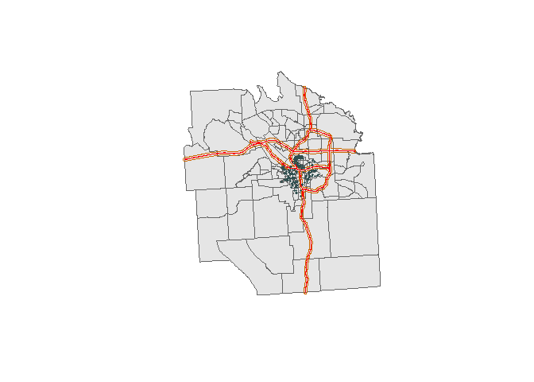

### Add Buffer Flag

Flags houses that fall within the buffer zone.

``` r
houses <- SpatialPoints(dat$coords, proj4string = CRS("+proj=longlat +datum=WGS84"))
houses.subset <- houses[buffer, ]
dat$interstate <- over(houses, buffer)
dat$interstate[is.na(dat$interstate)] <- 0
```

Highlight houses in buffer zone

``` r
par(mar=c(0,0,0,0))
plot(syr, col="grey90" , border="grey40")
plot(roads.clipped, col="red", lwd=1, add=T)
points(houses, pch=20, cex = 0.7, col="darkslategrey")
points(houses.subset, pch=20, cex = 0.7, col="darkorange1")
```

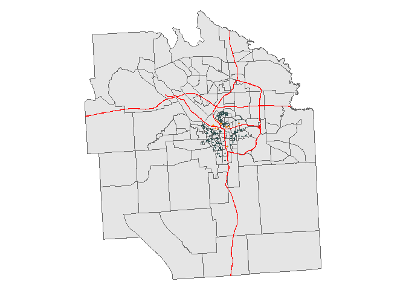

Part II
=======

GeoJSON Shapefiles
------------------

Load geojson shapefiles.

``` r
syr <- readOGR(dsn = "Support Files/Shapefiles/SYR_GEOJSON.geojson")
```

    ## OGR data source with driver: GeoJSON 
    ## Source: "Support Files/Shapefiles/SYR_GEOJSON.geojson", layer: "OGRGeoJSON"
    ## with 41502 features
    ## It has 64 fields

``` r
syr <- spTransform(syr, CRS=CRS("+proj=longlat +datum=WGS84"))
```

Industrial Buffer
-----------------

Generates a buffer of approximately a quarter mile around industrial zones.

``` r
buffer.industrial <- gBuffer(syr[syr$LandUse == "Industrial", ], width = .004)
```

Plot buffer around industrial zones.

``` r
color.industrial <- as.character(syr$LandUse)
color.industrial[color.industrial=="Industrial"] <- "yellow4"
color.industrial[color.industrial!="yellow4"] <- "grey90"
par(mar=c(0,0,0,0))
plot(syr, col=color.industrial, border=NA)
plot(buffer.industrial, border="yellow2", add=T)
```

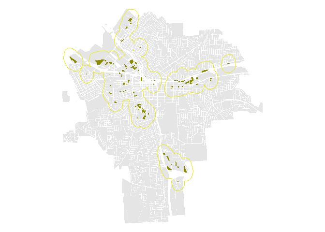

Add Industrial Flag
-------------------

Adds a boolean flag to the dataset to indicate proximity to an industrial zone

``` r
dat$industrial <- over(houses, buffer.industrial)
dat$industrial[is.na(dat$industrial)] <- 0
```

Plot houses inside and outside the industrial buffer zone.

``` r
color.house.ind <- as.character(dat$industrial)
color.house.ind[color.house.ind=="1"] <- "darkorange1"
color.house.ind[color.house.ind!="darkorange1"] <- "darkslategrey"
par(mar=c(0,0,0,0))
plot(syr, col=color.industrial, border=NA)
plot(buffer.industrial, border="yellow2", add=T)
points(dat$coords, pch=20, cex = 0.7, col=color.house.ind)
```

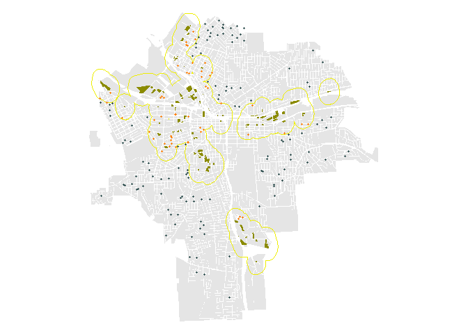

School Buffer
-------------

Generates a buffer of approximately an eighth of a mile from school.

``` r
buffer.school <- gBuffer(syr[syr$LandUse == "Schools", ], width = .002)
```

Plot buffer around schools.

``` r
color.school <- as.character(syr$LandUse)
color.school[color.school=="Schools"] <- "forestgreen"
color.school[color.school!="forestgreen"] <- "grey90"
par(mar=c(0,0,0,0))
plot(syr, col=color.school, border=NA)
plot(buffer.school, border="green3", add=T)
```

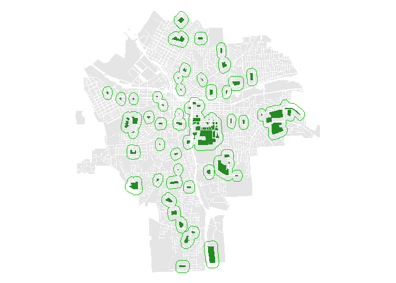

Add School Flag
---------------

Adds a boolean flag to the dataset to indicate proximity to a school.

``` r
dat$school <- over(houses, buffer.school)
dat$school[is.na(dat$school)] <- 0
```

Plot houses inside and outside the school buffer zone.

``` r
color.house.sch <- as.character(dat$school)
color.house.sch[color.house.sch=="1"] <- "darkorange1"
color.house.sch[color.house.sch!="darkorange1"] <- "darkslategrey"
par(mar=c(0,0,0,0))
plot(syr, col=color.school, border=NA)
plot(buffer.school, border="green3", add=T)
points(dat$coords, pch=20, cex = 0.7, col=color.house.sch)
```

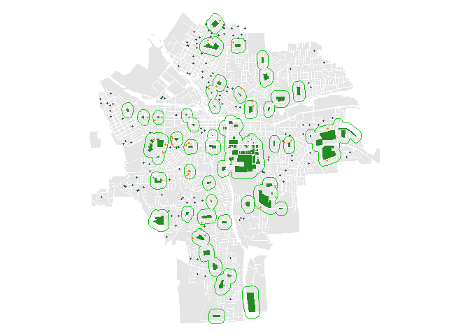
